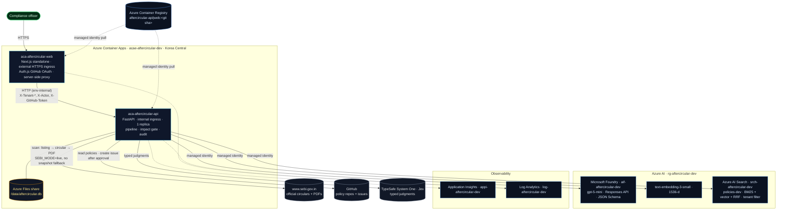
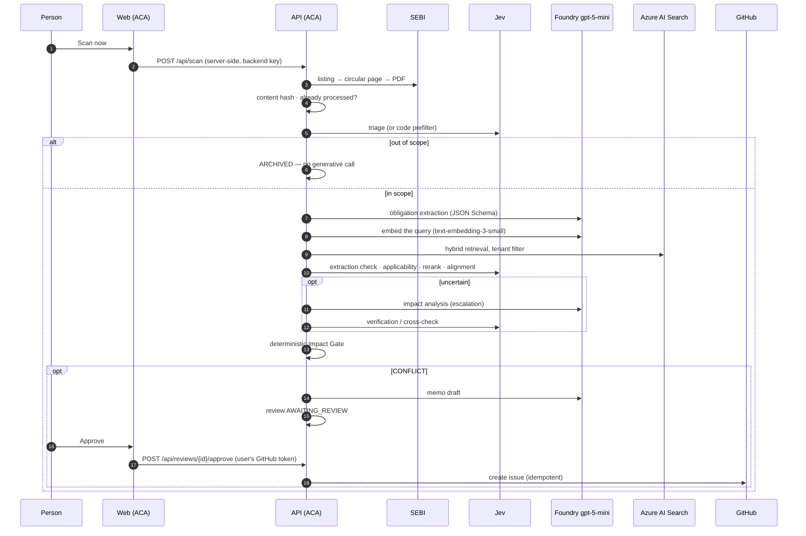

# AfterCircular — production architecture

Two containers in one Azure Container Apps environment. The API is internal: only the web app reaches it, server-side,
which is where the backend key and the signed-in user's GitHub token stay. Nothing in the diagram is aspirational —
every edge exists in the code and is exercised by the deployed system.

## One document, end to end

## Why this shape

- **Container Apps, not AKS/App Service.** Two stateless HTTP containers, scale-to-few, managed identity, built-in
  ingress and revisions. No cluster to operate, no Students credit burned on idle nodes.
- **API internal.** The browser has no reason to reach it: the web app already proxies every call so the backend key and
  the user's GitHub token never leave the server.
- **One API replica.** The database is a single SQLite file on the share; one writer avoids cross-replica locking.
  Scaling past that means PostgreSQL, not more replicas (`azureDecision.md` §21).
- **Managed identity everywhere it works** — Foundry, Search, ACR. Static secrets remain only for services outside Azure
  (GitHub, Jev) and the shared frontend↔API key.
- **Official SEBI connector stays authoritative.** Foundry Web Search exists only behind the Ask `web_lookup` intent and
  is labelled discovery; a publication becomes evidence only after the connector fetches, hashes and analyses it.

## Known, accepted

- **React hydration warning (#418) on two dashboard pages in a production build.** Both pages render correctly (HTTP 200,
  content verified in a headless browser); React re-renders the affected subtree on the client. Not reproducible in the
  dev server, and no user-visible defect was found. Tracked, not fixed — the deterministic UTC timestamps and pinned
  number formatting removed the mismatches that were locatable.
- **One API replica.** The database is a single SQLite file on a share; horizontal scale requires PostgreSQL first.
- **Entra ID inside a local container** needs a dev service principal; the host's `az login` is not visible in the image.
  In Azure the managed identity covers it, so this affects only `docker compose`.
